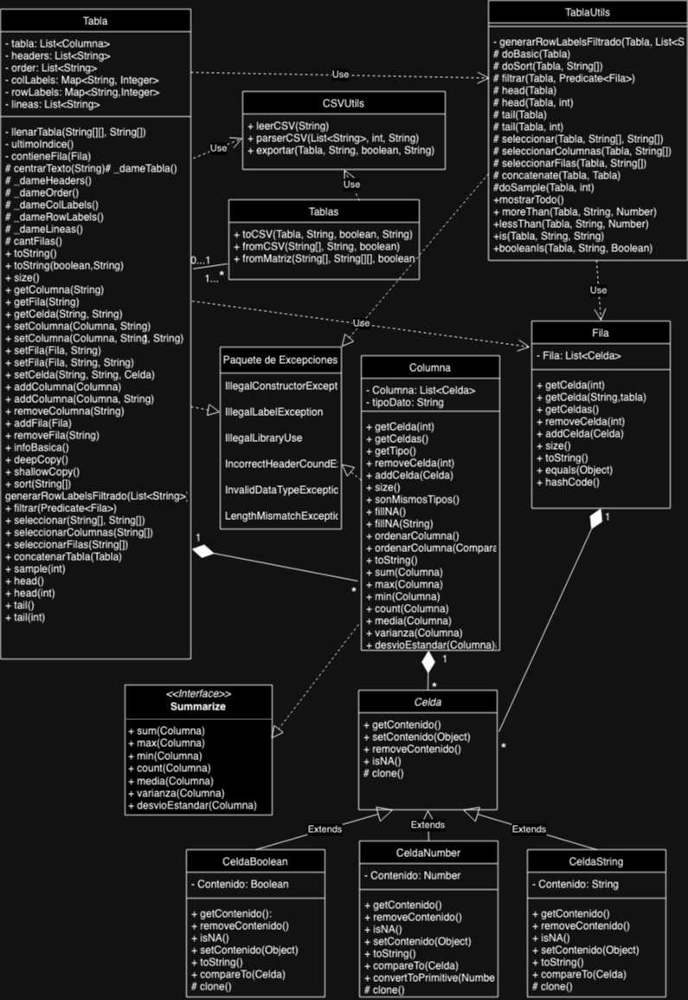

# Trabajo Final

## El trabajo práctico (Taylor's Version)

Hicimos lo que pudimos

* Documentación de Análisis [acá](https://docs.google.com/document/d/1R0CwfF0x-OMGKQ3HtEs_add5s46XUGyCvuVzTmp-448/edit?usp=sharing)
* Presentación [acá](https://www.canva.com/design/DAF0kHkoSio/iVOmc0wrwicIEFszQ12AFA/edit)

## Uy Me Liquidaste (UML)

Lo venismo laburando [acá](https://app.diagrams.net/#G1uOmkSMVSnc9sIp5enAJivf20Tdg5pN5G)

